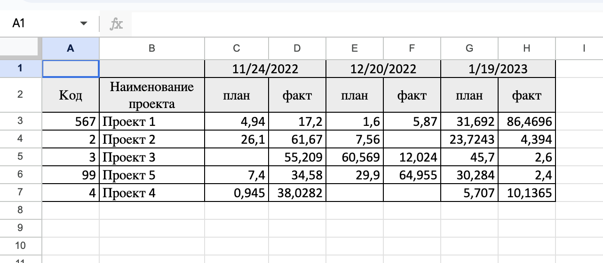

# Тестовое задание Rootcode

REST API сервис для загрузки/выгрузки excel файлов

## Цель проекта:
Создание сервис для загрузки/выгрузки данных определенного формата, сохранения этих данных в
базу данных и последующего построения отчета по ним.

### Основные возможности:

- загрузка из файла и сохранение в БД
- выгрузка данных из БД и сохранение в файл
- получение выборки данных по определенным параметрам (год, версия файла, тип значения)

### Стек:

- Fastapi
- Sqlalchemy
- alembic
- docker
- pandas
- xlsxwriter

## Установка
1. Установить docker
2. Переименовать файл .env.template из корня проекта в .env 
3. Заполнить файл .env своими настройками (можно использовать настройки по умолчанию)
4. В командной строке перейти в папку проекта и выполнить команду:

    $ docker compose up -d

Для включения отладки переименовать файл _docker-compose.override.yml в docker-compose.override.yml.
Для отключения - переименовать обратно. 

Запуск на локальном хосте: localhost:8000

**Ссылка на OpenApi документацию** -
/api/docs

### Описание api:

/api/upload/ - загружает excel файл в определенном формате. При загрузке проверяется все ли 
проекты из файла есть в базе данных. Если какие-то проекты отсутствуют в базе - они создаются.

**Пример фала:**

/api/download/<version_id>/ - выгружает файл в формате аналогичном загружаемому.
Данные в файле отсортированы по датам.

/api/report/ - получает выгрузку данных по определенным признакам с группировкой по датам. 
Параметры: 
- year - фильтруются данные за указанный год. Пример: /api/report/?year=2022. При отсутствии - получаем данные по всем годам.
- version - получаем данные по конкретной версии фала. Пример: /api/report/?version=1. При отсутствии - получаем данные по всем версиям.
- type_value - фильтрует данные по типу значения ("plan", "fact"). Пример: api/report/?type_value=p. При отсутствии получаем оба значения.